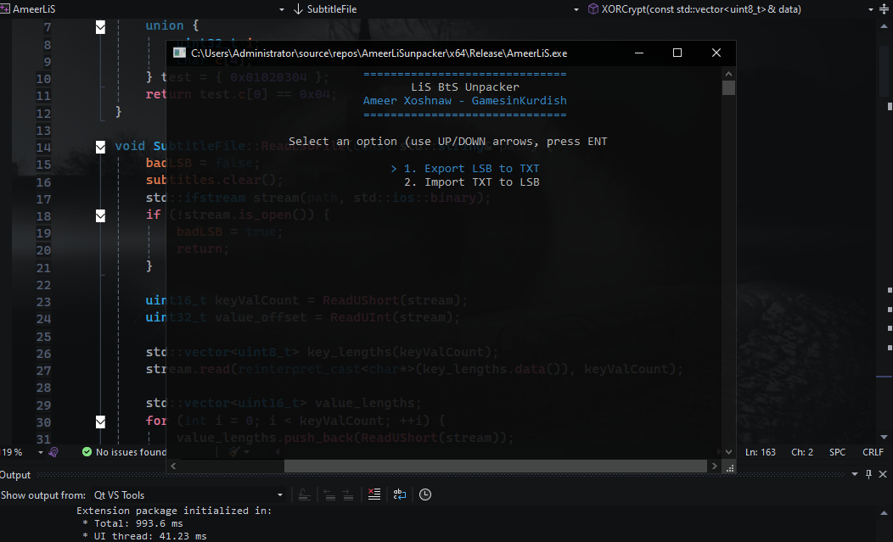

<div align="center">
  <h1>LSBExtractImport</h1>
  <p><strong>A console tool to extract and import <em>Life is Strange: Before the Storm</em> subtitle files</strong></p>
  <p>Effortlessly convert <code>.lsb</code> files to editable <code>.txt</code> and back, with full UTF-8 support, a smooth arrow-key menu, and drag-and-drop folder magic. Built with ❤️ by Ameer Xoshnaw.</p>

  

  <p>
    
    
    
  </p>
</div>

##Features
- **Extract & Import**: Convert `.lsb` subtitle files to `.txt` for editing in Notepad, then import back to `.lsb` with original names.
- **Unicode Support**: Handles UTF-8 characters flawlessly for multilingual subtitles.
- **Intuitive Menu**: Navigate with up/down arrow keys and Enter—no flicker, just smooth!
- **Drag-and-Drop**: Drop a folder onto the executable to process files instantly.
- **Clean Workflow**: Deletes `.txt` and `.bkp` files after import, no `.lsb` backups created.
- **Stylish Console**: Cyan (#aafffc) and white interface with a sleek "Ameer Xoshnaw" header.
- **Windows-Optimized**: Built for Windows, leveraging native APIs for performance.

##Getting Started

### Prerequisites
- **OS**: Windows 10/11
- **Compiler**: Visual Studio 2022 with C++17 support
- **Dependencies**: `Shell32.lib` for Notepad integration

###Installation
1. **Clone the Repository**:
   ```bash
   git clone https://github.com/kh0shn4w/LSBExtractImport.git
   cd LSBExtractImport
